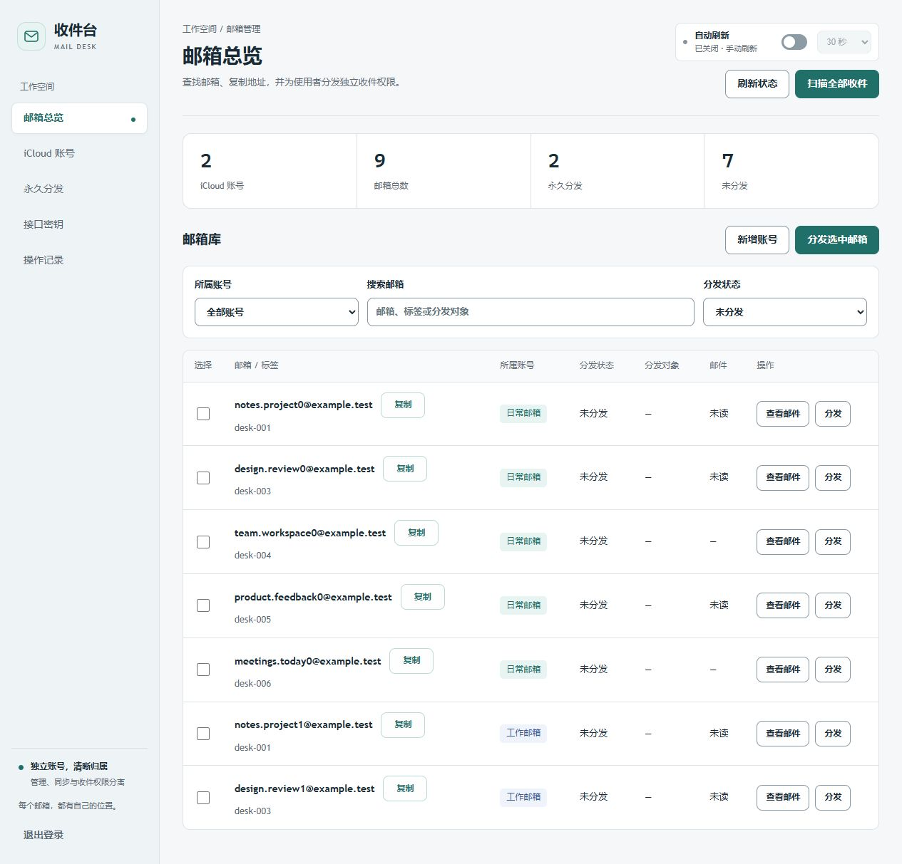
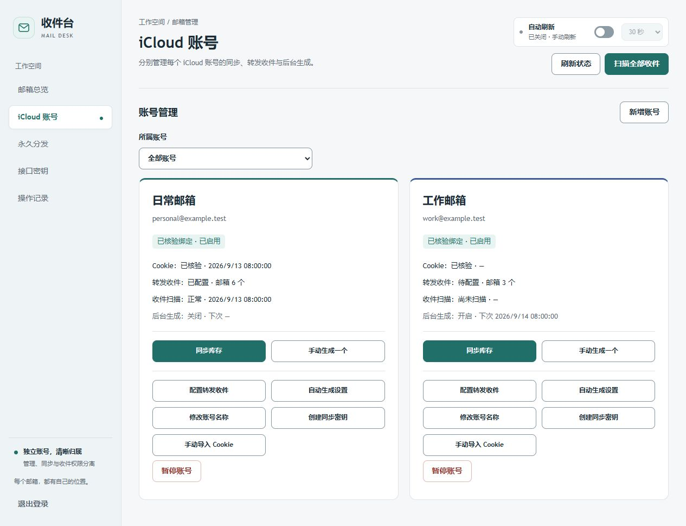
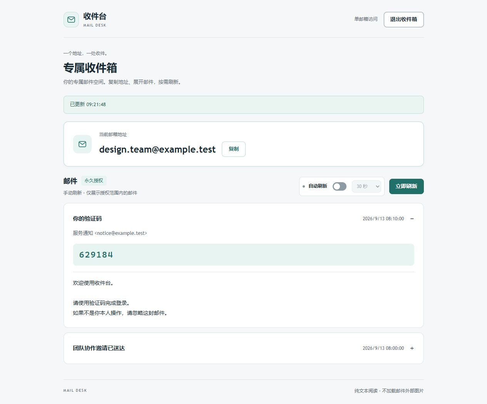
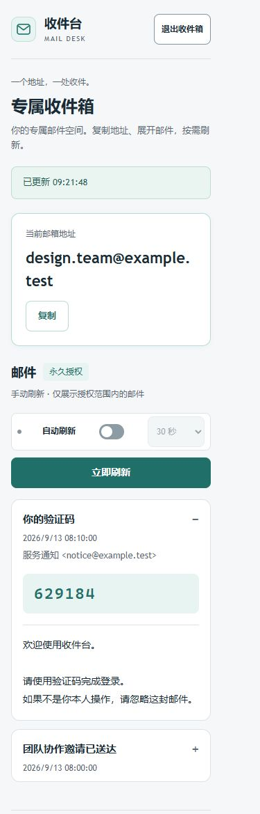

# Mail Code Dashboard

一个支持多 iCloud 账号的隐藏邮箱管理与收件平台，提供统一管理后台、后台生成任务、单邮箱访问授权和 Chrome Cookie 同步扩展。

## 功能

- **多账号管理**：独立保存账号身份、库存、收件配置、生成队列与同步状态，在同一后台查看和筛选。
- **隐藏邮箱管理**：同步邮箱列表，管理标签和状态，支持手动生成与后台定时生成。
- **账号绑定校验**：Cookie 同步时核验 Apple 会话归属，避免覆盖其他账号配置。
- **转发收件**：通过 IMAP 获取转发邮件，按收件地址匹配，展示正文与验证码。
- **单邮箱分发**：只有明确分发时才创建 Token，默认永久有效；支持撤销和重置。
- **权限分离**：管理员登录、程序 API Key、Cookie 同步密钥和收件 Token 使用不同权限。
- **Docker 部署**：提供 Docker Compose、双域名 HTTPS 入口、持久化数据卷和健康检查。

## 界面预览

浅色界面支持桌面与手机使用；自动刷新默认关闭，可按需开启。

> 以下截图均使用合成示例数据，不包含真实账号、邮件或密钥。

### 邮箱总览

统一查看邮箱库存与分发状态，按账号、关键词筛选，并一键复制邮箱地址。



<details>
<summary>查看更多：账号管理、桌面收件页与手机收件页</summary>

### 账号管理

分别查看各账号的身份、收件配置与生成任务状态。



### 桌面收件页

突出显示当前邮箱地址，支持一键复制、手动刷新与纯文本邮件阅读。



### 手机收件页

窄屏下保持清晰的邮箱身份、刷新操作与邮件内容。



</details>

## 快速开始

服务器部署需要 Linux、Docker Compose、两个域名，以及可访问 iCloud 和 IMAP 的网络。

```sh
git clone https://github.com/bbbbbbbin/mail-code-dashboard.git
cd mail-code-dashboard
cp deploy/env.example .env
```

在 `.env` 中填写管理员域名和收件域名，按 [部署指南](docs/server-deployment.md) 创建独立主密钥、初始化管理员，然后启动服务。

> 初始化凭证和数据目录不随源码提供。不要把 Cookie、密码、Token、邮件或备份提交到仓库。

## 使用流程

1. 登录管理后台，创建 iCloud 账号并填写预期 Apple 登录邮箱。
2. 为账号创建专属同步密钥，在对应 Chrome 配置文件中安装并配置扩展。
3. 同步 Cookie、完成身份核验后启用账号，配置转发 IMAP 邮箱。
4. 同步邮箱库存，按需开启后台生成任务。
5. 选择邮箱并确认分发，将收件网址和该邮箱的 Token 提供给使用者。
6. 在后台查看分发状态、访问记录，并按需撤销或重置授权。

每个 Chrome 配置文件应只绑定一个 iCloud 账号。多个窗口不等于多个独立配置文件。

## 文档

- [服务器部署、权限与备份](docs/server-deployment.md)
- [Chrome 扩展安装与配置](extensions/chrome-cookie-bridge/README.md)
- [API 参考](docs/api.md)
- [开发与测试](docs/testing.md)
- [设计系统](docs/design-system.md)

## 运行模式

- `hosted.mjs`：多账号服务器模式，通过 HTTPS 反向代理提供管理后台和单邮箱收件页。
- `server.mjs`：单机模式，限制回环地址访问，使用 `X-API-Key` 认证。不要直接将该入口暴露到互联网。

使用服务器模式时请遵循部署指南，不要用单机接口替代服务器认证体系。

## 安全与数据

- Cookie 和转发授权码加密保存；主密钥独立于数据卷管理。
- 管理员密码使用密码哈希；访问 Token 只持久化摘要，完整 Token 仅在创建或重置时返回。
- 收件 Token 默认无到期时间，浏览器登录会话独立设定有效期；撤销或重置会使旧会话失效。
- 分发默认不开放此前邮件，不自动回收或再次分发已分发地址。
- 收件页展示纯文本，不加载邮件内的脚本或远程跟踪图片。
- 数据文件异常时报告错误，不静默用空库存覆盖。

此版本采用单实例写入，不支持多个应用实例同时写入同一个数据卷。Apple 网页接口可能变化；长期授权不等于地址、登录状态或邮件保留期永久有效。

## 开发

要求 Node.js ≥ 22.13，推荐使用 Node.js 24。

```sh
npm ci
npm test
node --test extensions/chrome-cookie-bridge/test/background.test.mjs
node scripts/check-distribution.mjs
```

测试使用合成数据。更多检查与容器测试见 [开发与测试](docs/testing.md)。
